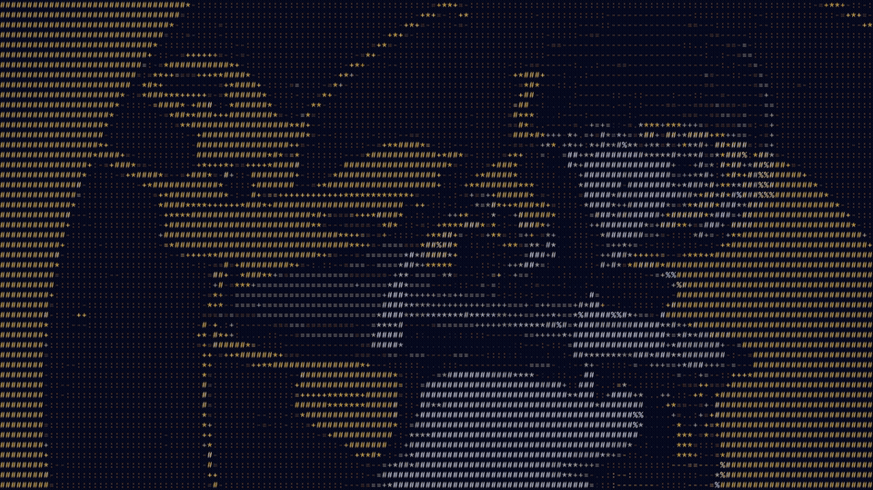

# ASCII Wallpaper

Convert any video into an **ASCII-art live wallpaper** tinted to your current Omarchy theme.



Found a gorgeous video wallpaper online that clashes with your colorscheme? This transcodes it into a grid of monospace glyphs where every color is snapped to your theme's `colors.toml` so it always matches.

Works great with [tenzin.live-wallpaper](https://plugins.omarchy.org/plugin.html?id=tenzin.live-wallpaper) (what I use)

video-wallpaper plugin — the output is a plain `.mp4` in your theme's
backgrounds folder, so it shows up in the normal background picker.

## Install

```
omarchy plugin add https://github.com/Betim-Hodza/omarchy-ascii-wallpaper
```

Then enable `betim.ascii-wallpaper` in **Setup > Plugins** (or `omarchy plugin enable betim.ascii-wallpaper`).

## Use

**Menu:** `Super+Space` → **Style → ASCII Wallpaper** (or just type `ascii`).

1. Pick a video — the picker lists every video under
   `~/.config/omarchy/backgrounds/<current-theme>/`, plus a browse option.
2. Pick a color mode.
3. It converts with a live progress bar and notifies when done. The result is
   written as `<name>-ascii.mp4` next to the source.

**CLI:** the same converter is bundled at
`~/.config/omarchy/plugins/betim.ascii-wallpaper/ascii-wallpaper`:

```
ascii-wallpaper <video> [-o out.mp4]
  --mode themed|source|mono   themed snaps every cell to your theme palette (default)
  --ramp classic|detailed|blocks|digits|binary|" <chars>"
  --rows N                    grid density
  --crf N --preset NAME       encode tuning
  --preview out.png           render the first frame to PNG for a quick check
```

### Color modes

| Mode | Result |
|------|--------|
| `themed` | Every glyph color is snapped to the nearest color in the current theme's `colors.toml`. Peak omarchy. |
| `mono` | Theme `foreground` on `background` only — the classic terminal look. |
| `source` | Keeps the video's own colors, quantized to a 216-color cube. |

## How it works

ffmpeg downscales each frame to the cell grid (`flags=area`, so each cell is a
true average), a small Python script maps cell luminance to a glyph ramp and
blits pre-tinted JetBrainsMono Nerd Font tiles, and libx264 encodes the result.
Multiprocessed; roughly realtime-ish on a modern CPU.

No Python packages needed, just `ffmpeg` and `imagemagick`, both already on a stock Omarchy install.

## Uninstall

```
omarchy plugin remove betim.ascii-wallpaper
```

Disabling or removing the plugin unwires its menu entry automatically. Already-
converted `-ascii.mp4` files are plain videos and are left in place.

## Notes

- Theme colors are baked into the output video. After switching themes, re-run
  the conversion to re-tint.
- Requires `gum` for the picker flow (stock on Omarchy).

## License

MIT
